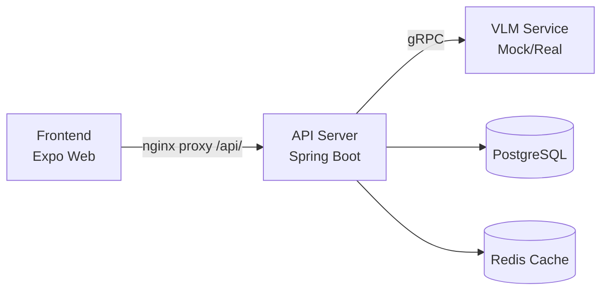

# 내 손안의 AI 폐기물 처리 도우미

> **waste-helper** — AI 기반 폐기물 분류 도우미

## 아키텍처



> 전체 시스템 아키텍처(데이터 흐름, K8s 배포, 인증, GitOps 등)는 [docs/architecture.md](docs/architecture.md) 참조

## 구조

```
waste-helper/
├── api-server/          # JHipster API 서버 (Spring Boot 3.x, Gradle)
├── frontend/            # 모바일/웹 프론트엔드 (Expo SDK 54, expo-router v6)
├── mock-vlm/            # Mock VLM gRPC 서비스 (Python, Flask + gRPC)
├── k8s/                 # Kubernetes 매니페스트 & Helm Chart
│   ├── manifests/       # K8s raw manifests
│   ├── helm/            # Helm Chart
│   └── argocd/          # ArgoCD Application
├── docs/                # 설계 문서
├── scripts/             # 유틸리티 스크립트
└── README.md
```

## 기술 스택

| Component       | Technology                                          |
|-----------------|-----------------------------------------------------|
| Frontend        | Expo SDK 54, React Native 0.81, expo-router v6, NativeWind v4 |
| API Server      | Spring Boot 3.x, JHipster 9, Java 21, Gradle       |
| Database        | PostgreSQL                                          |
| Cache           | Redis                                               |
| Auth            | JWT                                                 |
| VLM Service     | Python 3.12, gRPC, Flask                            |
| AI Model        | Qwen3-VL-4B (Mock: Python gRPC 서버)               |
| Infra           | Proxmox Kubernetes (OrbStack), ArgoCD               |

## 로컬 개발

### Make 타겟

```bash
make help          # 전체 타겟 목록
make loc-up        # 로컬 K8s 전체 스택 실행
make loc-down      # 로컬 K8s 전체 스택 중지
make loc-logs      # 로컬 로그 확인
```

### Frontend

```bash
cd frontend

# 의존성 설치
pnpm install

# 웹 개발 서버 실행 (port 8081)
pnpm start -- --web

# TypeScript 타입 체크
npx tsc --noEmit

# 웹 프로덕션 빌드 (Docker)
make build-frontend-docker

# K8s 배포
make deploy-frontend
```

### API 서버

```bash
cd api-server
./gradlew bootRun
```

### VLM 서비스 (Mock)

```bash
cd mock-vlm
docker build -t waste-helper/vlm-service:latest .
docker run -p 50051:50051 -p 8000:8000 waste-helper/vlm-service:latest
```

### 외부 기기에서 테스트

같은 WiFi망의 스마트폰에서 접속:

```bash
# Frontend 포트포워딩 (0.0.0.0 바인딩)
kubectl port-forward -n waste-helper svc/frontend 33080:80 --address 0.0.0.0

# API Server 포트포워딩
kubectl port-forward -n waste-helper svc/api-server 32067:8080 --address 0.0.0.0
```

- Frontend: `http://<machine-ip>:33080`
- API Server: `http://<machine-ip>:32067`

## Frontend 구조

```
frontend/
├── app/                    # expo-router 페이지
│   ├── (tabs)/             # 탭 네비게이션
│   │   ├── index.tsx       # 홈 (카메라 촬영)
│   │   └── _layout.tsx     # 탭 레이아웃
│   └── classify/
│       └── result.tsx      # 분류 결과 상세
├── components/
│   ├── camera/             # 카메라 컴포넌트 (expo-image-picker)
│   └── ui/                 # 공통 UI 컴포넌트
├── hooks/                  # 커스텀 훅 (useClassify 등)
├── services/               # API 호출, 이미지 처리
├── constants/              # 설정, 테마
├── types/                  # TypeScript 타입 정의
└── Dockerfile              # nginx + Expo Web 빌드
```

## 문서

- [시스템 아키텍처](docs/architecture.md)
- [Backend 설계 문서](docs/superpowers/specs/2026-03-30-waste-helper-backend-design.md)
