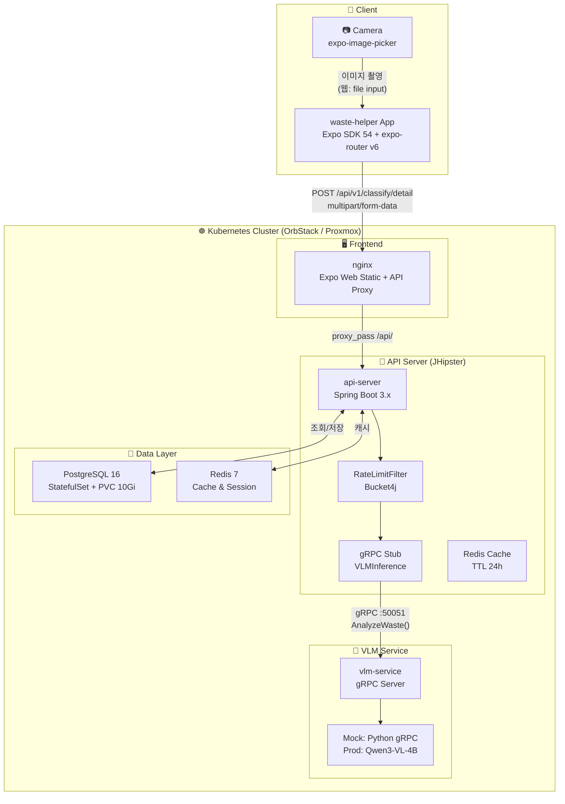
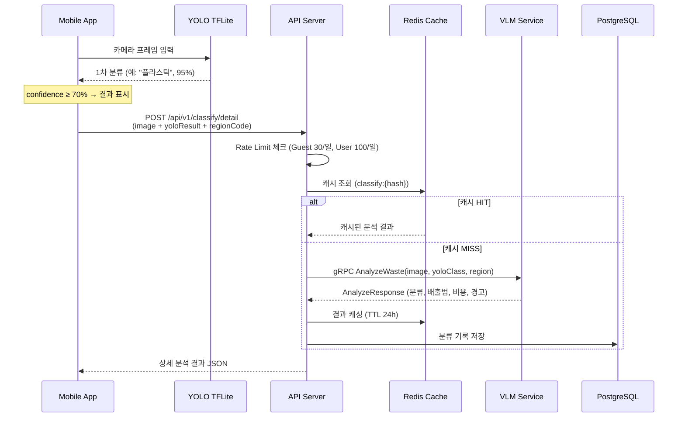
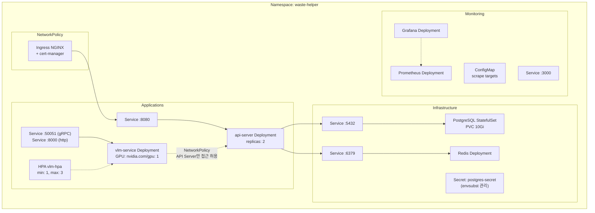
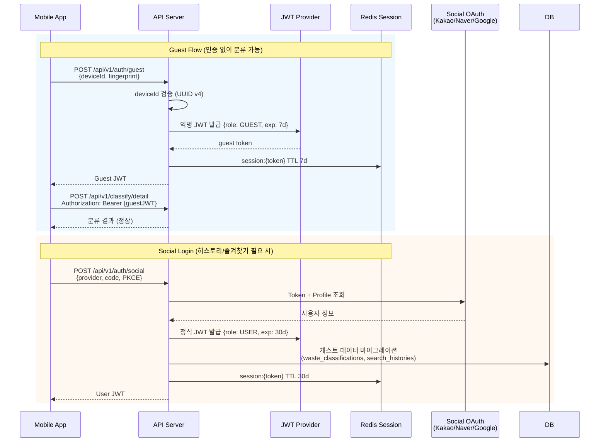
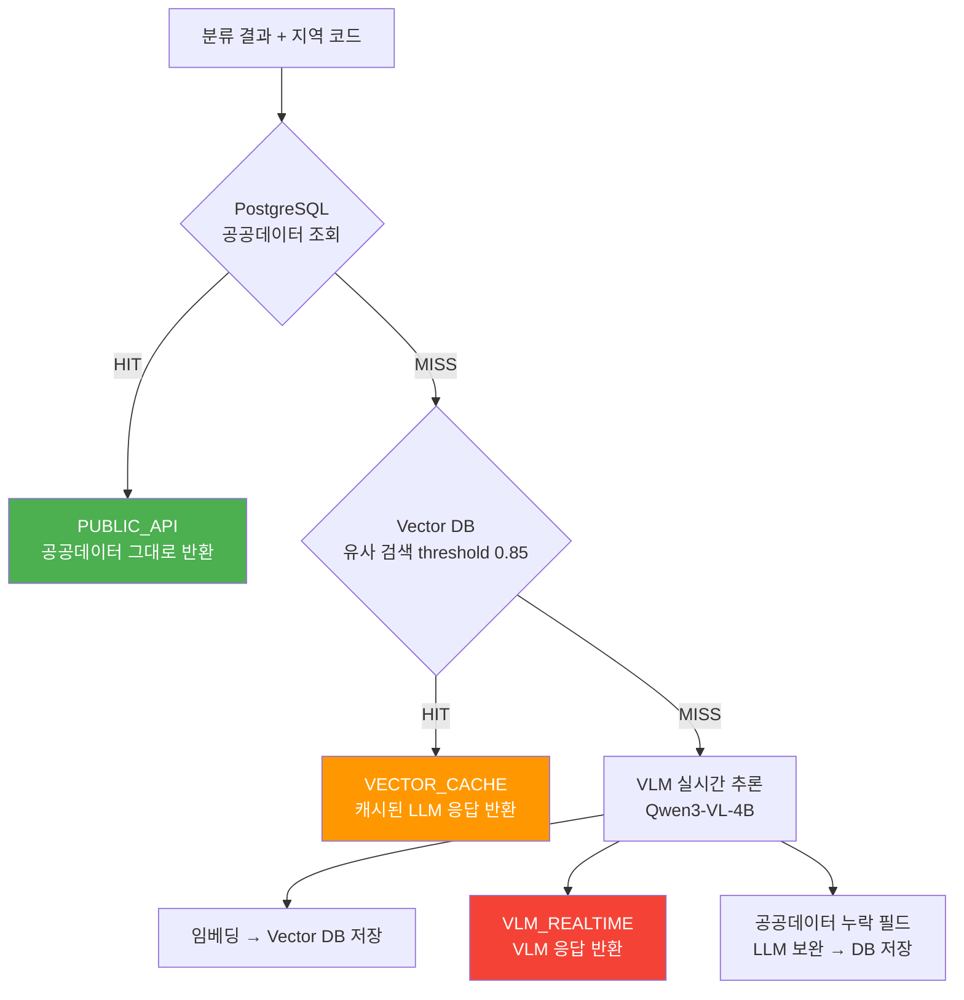
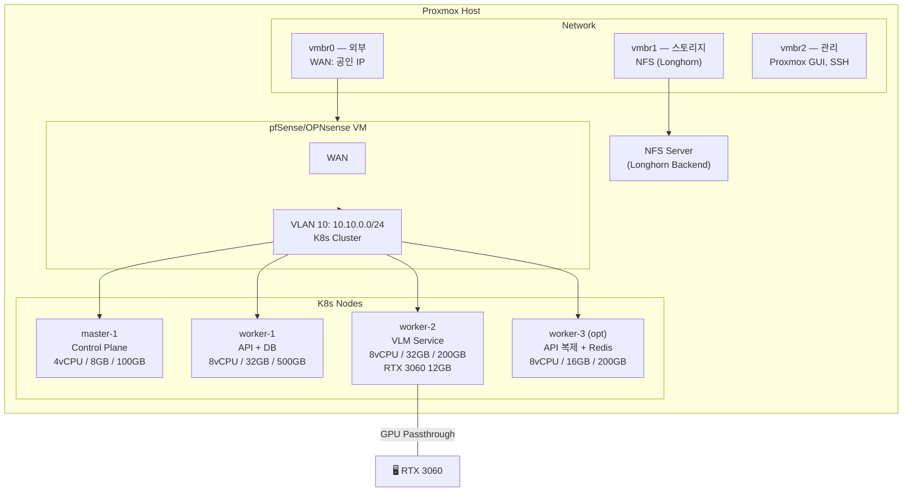
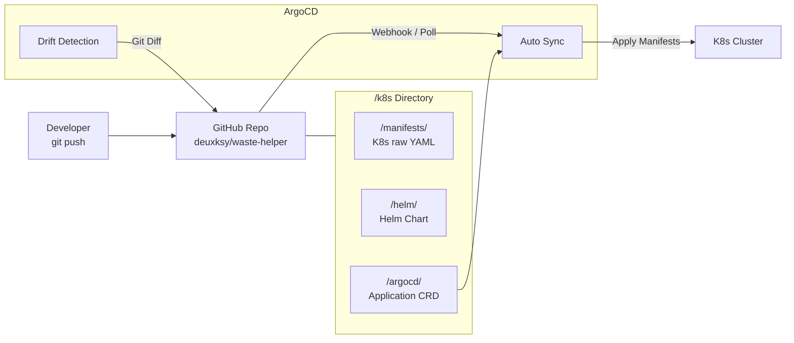
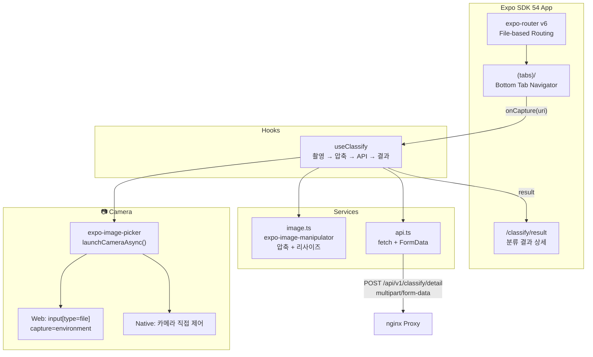
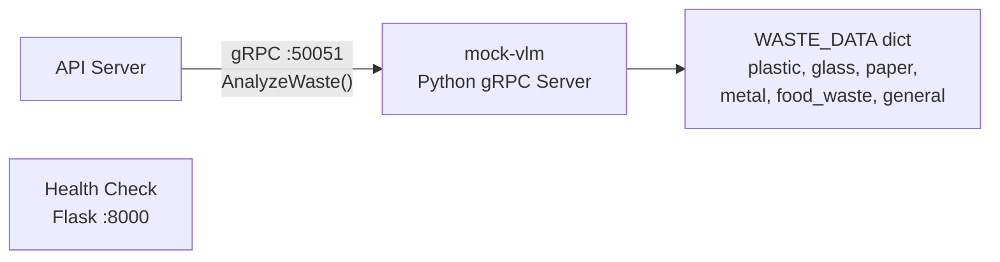

# waste-helper 시스템 아키텍처

> Phase 1 기준 — 전체 시스템 아키텍처 다이어그램

---

## 1. 전체 시스템 아키텍처



---

## 2. 분류 요청 데이터 흐름



---

## 3. K8s 네임스페이스 배포 구성



---

## 4. 인증 흐름



---

## 5. 배출 요령 조회 우선순위



---

## 6. Proxmox 클러스터 노드 구성



---

## 7. GitOps 배포 흐름



---

## 8. Frontend 아키텍처



### Frontend 기술 스택

| 항목 | 기술 |
|------|------|
| Framework | Expo SDK 54, React Native 0.81 |
| Routing | expo-router v6 (file-based) |
| Styling | NativeWind v4 (Tailwind CSS) |
| Camera | expo-image-picker (웹/네이티크 호환) |
| 이미지 처리 | expo-image-manipulator (압축/리사이즈) |
| 상태 관리 | React Hooks (useClassify) |
| 웹 배포 | nginx (정적 파일 + API 프록시) |

### 웹 vs 네이티브 카메라 동작

| Platform | 동작 |
|----------|------|
| **웹 브라우저** | `<input type="file" capture="environment">` → OS 카메라 앱 호출 |
| **iOS/Android 앱** | `expo-image-picker` native 카메라 모듈 직접 실행 |

### nginx 프록시 설정

```nginx
# /api/ → API Server (K8s 내부 통신)
location /api/ {
    proxy_pass http://api-server:8080/api/;
    proxy_connect_timeout 10s;
    proxy_read_timeout 30s;
}
```

---

## 9. Mock VLM Service

개발 환경에서 실제 AI 모델(Qwen3-VL-4B) 없이 gRPC 응답을 테스트하기 위한 Mock 서비스.



| Port | Protocol | 용도 |
|------|----------|------|
| 50051 | gRPC | AnalyzeWaste RPC |
| 8000 | HTTP | /health 엔드포인트 |

### Mock 응답 예시

```json
{
  "waste_type": "플라스틱",
  "disposal_method": {
    "method": "재활용 분리배출",
    "notes": ["라벨 제거 후 배출", "내용물 비우고 헹구기"],
    "items": [
      {"label": "본체", "action": "재활용"},
      {"label": "라벨", "action": "제거 후 일반 쓰레기"}
    ]
  },
  "confidence": 0.9
}
```
