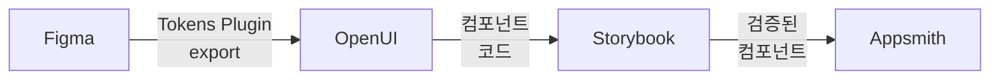
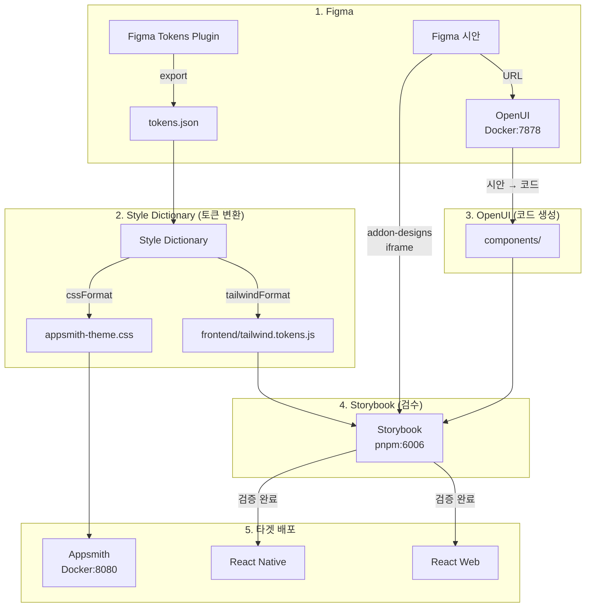
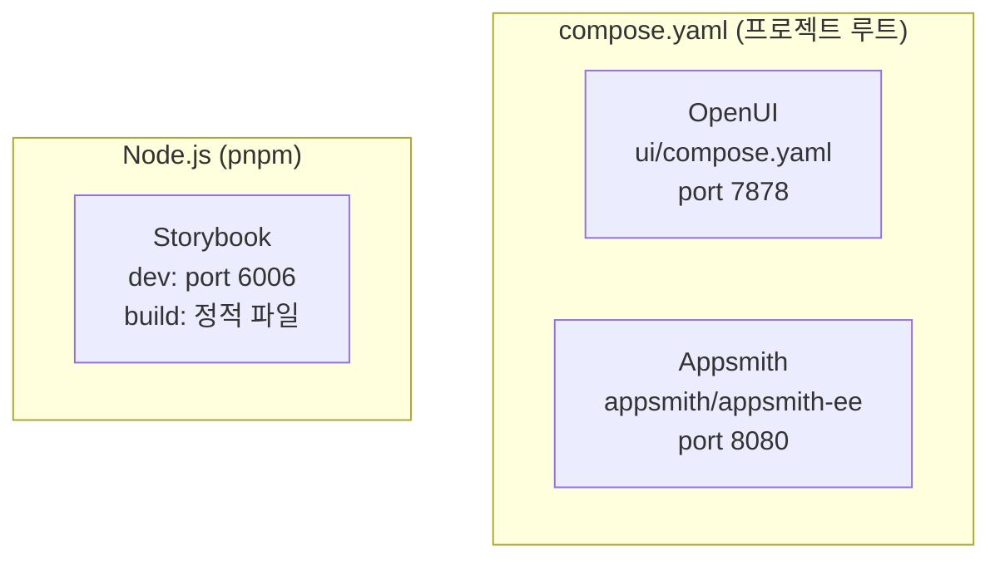

# Design Spec: Figma → OpenUI → Storybook → Appsmith 파이프라인

> **날짜**: 2026-04-06
> **상태**: Draft
> **프로젝트**: 내 손안의 AI 폐기물 처리 도우미

## TL;DR

Figma를 단일 디자인 소스로 삼아 OpenUI → Storybook → Appsmith로 이어지는 선형 파이프라인 구축. Design Tokens를 Style Dictionary가 Tailwind(NativeWind) + Appsmith CSS로 분배하고, Storybook에서 시각 검수 후 3개 타겟(React Web, React Native, Appsmith)에 배포.

## 1. 아키텍처



### 1.1 파이프라인 흐름 (상세)



| 단계 | 도구 | 입력 | 산출물 |
|---|
| 1. Figma | Figma Tokens Plugin (Jan Six) | 디자인 시안 | `tokens.json`, 시안 URL |
| 2. Style Dictionary | `style-dictionary` | `tokens.json` | Tailwind tokens JS + Appsmith CSS |
| 3. OpenUI | Docker (`ghcr.io/wandb/openui`) | Figma 시안 URL | React/RN 컴포넌트 코드 |
| 4. Storybook | `@storybook/react-native-webserver` | 컴포넌트 + 토큰 | 검증된 컴포넌트 카탈로그 |
| 5. Appsmith | Docker (`appsmith/appsmith-ee`) | Design Tokens CSS | 관리자 UI (커스텀 테마) |

### 1.2 최종 타겟

| 타겟 | 용도 | 토큰/컴포넌트 전달 |
|---|
| Appsmith | 관리자 UI | Design Tokens → Custom Theme CSS |
| React Web | 웹 프론트엔드 | Tailwind CSS + React 컴포넌트 |
| React Native | 모바일 앱 | NativeWind + RN 컴포넌트 |

## 2. 디렉토리 구조

```
waste-helper/
├── ui/                              # 파이프라인 인프라
│   ├── compose.yaml                 # OpenUI + adapter (기존 docker-compose.yaml → 이름 변경)
│   ├── aperture-adapter.py          # Aperture 프록시 (기존)
│   ├── litellm-config.yaml          # 모델 설정 (기존)
│   ├── tokens/
│   │   └── tokens.json              # Figma Tokens Plugin에서 export
│   ├── scripts/
│   │   ├── figma-sync.sh            # Figma API → tokens.json 동기화
│   │   └── sd-build.sh              # Style Dictionary 빌드 실행
│   └── sd/
│       └── config.js                 # Style Dictionary 설정
│
├── frontend/                         # Expo 앱 + Storybook
│   ├── .storybook/
│   │   ├── main.ts                  # addon-designs 포함
│   │   ├── preview.tsx              # 글로벌 데코레이터 (NativeWind)
│   │   └── app.tsx                  # Web 진입점
│   ├── app/                          # 기존 Expo 앱
│   ├── components/                   # OpenUI 생성 컴포넌트
│   ├── stories/                      # *.stories.tsx
│   ├── tailwind.config.js            # ← Style Dictionary에서 생성
│   └── package.json                  # Storybook 의존성 추가
│
├── compose.yaml                      # 프로젝트 루트 (Appsmith + 기존 서비스)
└── Makefile                          # 파이프라인 명령어
```

## 3. 배포 방식



| 도구 | 실행 방식 | 포트 |
|---|
| OpenUI | Docker (`ui/compose.yaml`) | 7878 |
| Appsmith | Docker (`compose.yaml`) | 8080 |
| Storybook | `pnpm storybook` (Node.js dev 서버) | 6006 |
| Storybook (배포) | `storybook build` → 정적 파일 (Nginx/CDN) | — |

**참고**: 기존 `ui/docker-compose.yaml` → `ui/compose.yaml`로 파일명 통일.

## 4. 추가 의존성

### frontend/package.json

```
@storybook/react-native-webserver   # Web + RN 동시 지원
@storybook/addon-designs            # Figma 프레임 임베드
@storybook/react                    # Web 렌더러
style-dictionary                    # 토큰 빌드 (ui/sd/에서 실행)
```

### ui/sd/config.js — Style Dictionary 플랫폼

| 플랫폼 | 포맷 | 출력 | 비고 |
|---|
| `tailwind` | `javascript/module` | `frontend/tailwind.tokens.js` | 기존 `tailwind.config.js`에서 `import`하여 `extend.colors` 등에 병합 |
| `appsmith` | `css/variables` | `appsmith-theme.css` | Appsmith Custom Theme에 직접 주입 |

## 5. Makefile 타겟

```makefile
# Token
token-sync          # Figma API → ui/tokens/tokens.json
token-build         # Style Dictionary → Tailwind + Appsmith CSS

# Storybook
storybook           # pnpm storybook (dev 서버, port 6006)
storybook-build     # 정적 빌드

# Appsmith
appsmith-up         # compose.yaml appsmith 서비스 실행
appsmith-down       # 중지

# 전체 워크플로우
ui-pipeline         # token-sync → token-build → storybook 순차 실행
```

## 6. 제약사항

- Figma Pro/Organization 계정 필요 (Variables API 접근)
- Aperture API 연결 필수 (OpenUI 백엔드)
- Storybook은 Docker 없이 pnpm으로 실행 (필요시 정적 빌드 후 Docker 서빙 가능)
- Appsmith 내장 MongoDB/Redis로 충분 (외부 DB 불필요)
